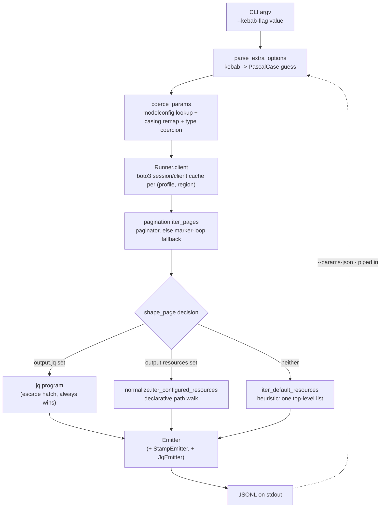

# One call, start to finish: how ajl decides what to run and how to shape it

The decision points a single `ajl <service> <operation> ...` invocation walks
through, end to end — and where a `--params-json` pipeline's next stage
plugs back into the front of this same flow. Decisions worth remembering are
logged in [DESIGN.md](../DESIGN.md); this is the narrative, with a real
example (`ajl ecs list-clusters`) worked through every stage.



## 1. Argv to params: two casing guesses, one from the model

`main.py`'s `parse_extra_options` turns `--cluster foo --desired-status RUNNING`
into `{"Cluster": "foo", "DesiredStatus": "RUNNING"}` — every CLI flag is
PascalCased, because that's what most boto3 operations expect. This is a
*guess*: it has no model in hand yet, just the flag name.

`coerce_params` is where the guess meets reality. It loads the operation's
real input shape (see below) and:

1. **Remaps every key to the model's actual member casing**, case-insensitive.
   Most AWS APIs are PascalCase, so `Cluster` already matches. A handful —
   ECS chief among them — define lowerCamelCase members (`cluster`, `tasks`,
   not `Cluster`/`Tasks`); without this remap boto3 rejects the call outright
   (`Unknown parameter in input: "Cluster"`). This bit us directly building
   the ecs pipeline below.
2. **Coerces each value** using the member's declared type (`"5"` -> `5` for
   an integer member, a JSON string -> a parsed list/dict for a
   list/structure/map member).
3. **With `filter_to_input=True`** (only in `--params-json` mode): drops any
   key that isn't a real input member at all. This is what lets a full
   `Type`/`Id`/`Name`/`Arn`/`Tags` ajl record get piped straight back into
   `--params-json -` — the properties the next operation doesn't want are
   silently dropped rather than erroring.

## 2. Finding the operation: per-service model, case-insensitive

`modelconfig.get_operation_config(service, operation_pascal)` loads
`ajl/models/<service>.json` (or `AJL_MODELS_DIR` override) and looks up the
operation. The first lookup is an exact match; if that misses, a
case-insensitive index catches the acronym-casing cases the kebab-to-Pascal
guess can't reconstruct (`list-open-id-connect-providers` guesses
`ListOpenIdConnectProviders`, but the real API name is
`ListOpenIDConnectProviders`). A miss here (no model for the service, or no
entry for the operation) just means no curated shaping — the call still
runs, output falls through to the heuristic path below.

## 3. Pagination: paginator first, marker loop as the fallback

`pagination.iter_pages` tries botocore's generated paginator first
(`client.can_paginate(operation)`) — it exists for virtually every list/describe
call and needs no model at all. When it doesn't exist, the model's
`input.markers`/`output.markers` metadata drives a manual marker loop
(`tools/generate-model.py` records these from the API's request/response
shapes when a paginator isn't available).

## 4. Shaping a page: three ways, one always wins

`shape_page` (`main.py`) checks the operation's `output` config in this order:

1. **`output.jq`** — a hand-written jq program. Always wins when present; the
   escape hatch for shapes the declarative config can't express.
2. **`output.resources`** — a declarative list of `{path, type, id, name,
   arn, arn_format, tags, scalar_as}` configs, applied by
   `normalize.iter_configured_resources`. This is the common case and is
   what `tools/apply-resource-configs.py` writes.
3. **Neither** — `iter_default_resources` heuristic: if the response has
   exactly one top-level list, stream its items unshaped (still gets
   `Type`/`Id`/`Name`/`Arn`/`Tags` — see below). Otherwise the raw response
   streams as-is.

### Worked example: `ecs.ListClusters`

The curated config is `r(["clusterArns"], "ecs:cluster", arn="clusterArn",
scalar_as="clusterArn")` — no `id`, no `name`, because `ListClusters`'
response is *only* an array of ARN strings (`clusterArns`), nothing else.
`scalar_as="clusterArn"` wraps each bare string into `{"clusterArn": "..."}`
so the path-walk and ARN lookup have a field to read.

That produces:

```json
{"Type":"ecs:cluster","Id":"salesagent-freewheel","Name":"","Arn":"arn:aws:ecs:us-east-1:381492092437:cluster/salesagent-freewheel","Tags":{},"clusterArn":"arn:aws:ecs:us-east-1:381492092437:cluster/salesagent-freewheel"}
```

Two things worth spelling out, since they come up every time a List*
operation only returns identifiers:

- **`Id` has no source field, so it falls back to the ARN's last path
  segment** (`normalize.py`'s documented fallback chain) — `Id` did not come
  from anywhere in the response *except* the ARN. Same rule everywhere: a
  resource with no natural id and a well-formed ARN always gets a sane `Id`.
- **`Name` is empty because `ListClusters` never returns a name** (and
  there's no `Tags` to fall back to — the list call doesn't return tags
  either). `DescribeClusters` (the paired describe call) does return
  `clusterName` and `tags`, which is why its curated config sets
  `name="clusterName", tags="tags"` and its output has a real `Name`.

## 5. Emitting and stamping

Shaped records go through `Emitter` (line-atomic stdout), optionally wrapped
by `TagMergeEmitter` (`--fetch-tags`), `JqEmitter` (`--jq`), and
`StampEmitter` (`--stamp-session`) — each wrapper adds one concern and passes
through to the next. `StampEmitter` adds `Profile`/`Region`/`Account` to
every record. `should_stamp_session()` turns this on automatically for
fan-out (`--all`/...) *and* for any `--params-json` stage (it's always
mid-pipeline, so it re-stamps whatever session info its own input carried) —
`--no-stamp-session` opts out.

## 6. Chaining into `--params-json -`: what propagates, what doesn't

A record piped into `--params-json -` re-enters at step 1 as one line's
`line_params`. Two things now propagate automatically (fixed together, see
DESIGN.md): the model-casing remap (step 1) and the session stamp (step 5).
**One thing does not, and has no generic fix**: there is no automatic
mapping from a shaped record's `Id`/`Arn`/`clusterArn` fields to whatever
literal parameter name the *next* operation expects. That mapping is
API-specific and has to be a `--jq` reshape today:

```shell
ajl ecs list-clusters --all-regions --profile nri-customer --stamp-session \
  | jq -c '{cluster: .clusterArn, Profile, Region, Account}' \
  | ajl ecs list-tasks --params-json -
```

It gets more API-specific still: `ecs.ListTasks`/`DescribeServices` take a
*singular* `cluster` (one call per cluster — fits the `--params-json`
one-line-per-call model directly), but `ecs.DescribeClusters` takes a
*plural* `clusters` array (one call describes many — a batch-describe shape,
the same pattern `ssm get --names` chunks 10-at-a-time in `ssm.py`). No
amount of generic field-name guessing resolves that difference; it's a
property of each operation's shape. A `--describe` flag that automatically
follows a List* call with its paired batch-Describe call (chunking
identifiers the way `ssm.py` already does) has been discussed as a cleaner
answer than teaching `--params-json` more input formats — not yet built;
it would slot in right after step 4, before the record ever reaches the
emitter.